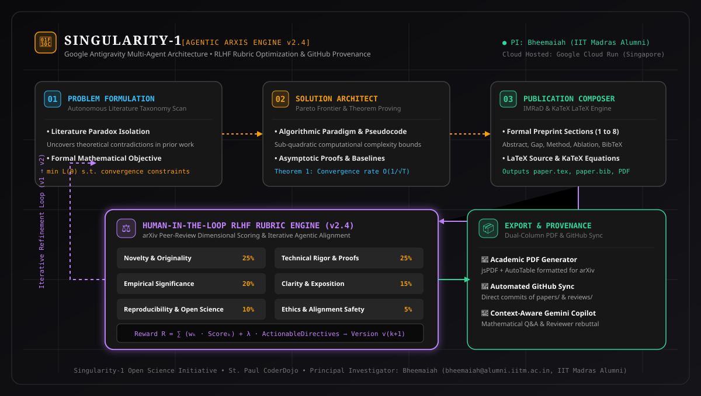

# 🌌 Singularity-1 Wiki • Open Science & arXiv Preprint Synthesis

Welcome to the official media-rich documentation wiki for **Singularity-1**, an autonomous multi-agent research platform powered by Google Antigravity and calibrated for top-tier arXiv preprints with Human-in-the-Loop RLHF Rubric Optimization.

---

### 🌐 Live Cloud Deployments

| Deployment Tier | Hosted URL | Status | Ingress Region |
| :--- | :--- | :---: | :--- |
| **Production / Shared** | [https://ais-pre-67bjrhkutnv3a34zametcr-219346993343.asia-southeast1.run.app](https://ais-pre-67bjrhkutnv3a34zametcr-219346993343.asia-southeast1.run.app) |  | Google Cloud Run (Singapore) |
| **Development Instance** | [https://ais-dev-67bjrhkutnv3a34zametcr-219346993343.asia-southeast1.run.app](https://ais-dev-67bjrhkutnv3a34zametcr-219346993343.asia-southeast1.run.app) |  | Google Cloud Run (asia-southeast1) |

---

### 🏛️ Principal Investigator & Authorship

- **Principal Investigator**: **Bheemaiah**
  - **Email**: [`bheemaiah@alumni.iitm.ac.in`](mailto:bheemaiah@alumni.iitm.ac.in)
  - **Alma Mater**: **Indian Institute of Technology Madras (IIT Madras) Alumni**
  - **Affiliation**: St. Paul CoderDojo / Singularity-1 Open Science Initiative
- **Co-Author Collective**: Google Antigravity Multi-Agent Collective
  - *Problem Formulation Agent* (Paradox & Literature Gap Isolation)
  - *Solution Architect Agent* (Theorems, Bounds & Pareto Frontiers)
  - *Publication Composer Agent* (IMRaD Structure & KaTeX Typesetting)
  - *Rubric Auditor & RLHF Alignment Engine* (Vector Evaluation & Refinement)
  - *Singularity Gemini Copilot* (Context-Aware Preprint Chatbot)

---

## 🗺️ Visual Architecture Flowchart

---

## 📑 Wiki Navigation Index

1. **[System Architecture & Antigravity Agents](./System-Architecture.md)**:
   Detailed decomposition of the three-phase synthesis pipeline, asynchronous telemetry, and inter-agent schemas.
2. **[Human-in-the-Loop RLHF Rubric v2.4](./RLHF-Rubric-v2.4.md)**:
   Mathematical formulation of the 6-dimension conference review rubric and reward-guided policy iteration ($v_k \to v_{k+1}$).
3. **[Context-Aware Gemini Research Copilot](./Gemini-Research-Copilot.md)**:
   Documentation of the interactive research chatbot grounded in active preprints, KaTeX math derivations, and reviewer rebuttal simulations.
4. **[Authorship & IIT Madras Heritage](./Authorship-and-Affiliations.md)**:
   Research statement, PI academic background, contact details, and institutional acknowledgments.
5. **[GitHub Provenance & Automated Sync](./GitHub-Provenance-and-Sync.md)**:
   Detailed protocol for committing Markdown, LaTeX, BibTeX, JSON telemetry, and peer reviews directly to GitHub repositories.

---

## 📊 arXiv Review Rubric Radar (v2.4)

---

> [!TIP]
> **Experience it Live**: Launch the [Singularity-1 Production App](https://ais-pre-67bjrhkutnv3a34zametcr-219346993343.asia-southeast1.run.app) to synthesize preprints across Quantum Computing, Non-Euclidean Graph Transformers, Neural Cryptography, and AI Safety.
