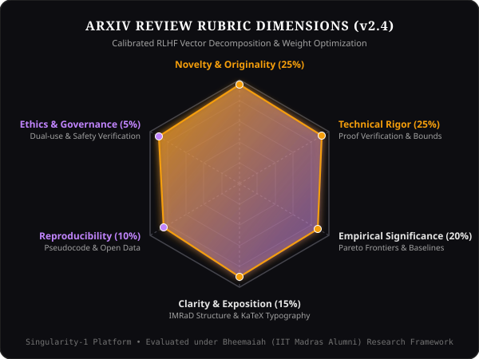

# ⚖️ Human-in-the-Loop RLHF Rubric (v2.4 Specification)

[← Back to Wiki Home](./Home.md) • [System Architecture](./System-Architecture.md) • [Live App](https://ais-pre-67bjrhkutnv3a34zametcr-219346993343.asia-southeast1.run.app)

---

## 🎯 Rubric Philosophy & Mathematical Weights

The Singularity-1 evaluation framework calibrates agentic paper generation against top-tier conference peer review standards (NeurIPS, ICML, ICLR, CVPR).

### Six Calibrated Evaluation Dimensions

| Dimension | Weight ($w_i$) | Score Range | Focus Criterion | Primary Failure Mode Addressed |
| :--- | :---: | :---: | :--- | :--- |
| **Novelty & Originality** | **25%** | 1.0 – 10.0 | Paradigm shift vs. incremental delta | Regurgitating standard transformer/CNN setups |
| **Technical Rigor** | **25%** | 1.0 – 10.0 | Proof correctness, lemmas & bounds | Hand-waving assertions without mathematical proofs |
| **Empirical Significance** | **20%** | 1.0 – 10.0 | Pareto gains over SOTA baselines | Unsubstantiated benchmark claims |
| **Clarity & Scholarly Exposition** | **15%** | 1.0 – 10.0 | IMRaD coherence & KaTeX math notation | Sloppy prose and confusing equation indices |
| **Reproducibility & Open Science** | **10%** | 1.0 – 10.0 | Pseudocode, hyperparameters & seeds | Omitted implementation details |
| **Ethics & Governance** | **5%** | 1.0 – 10.0 | Dual-use risks & compute disclosures | Ignoring environmental or alignment concerns |

---

## 🧮 Scalar Composite Reward Function

The overall quality scalar $R(\mathbf{s})$ is evaluated as:

$$R(\mathbf{s}) = \sum_{i=1}^{6} w_i \cdot s_i = 0.25 \cdot \text{Nov} + 0.25 \cdot \text{Rig} + 0.20 \cdot \text{Sig} + 0.15 \cdot \text{Cla} + 0.10 \cdot \text{Rep} + 0.05 \cdot \text{Eth}$$

### Decision Thresholds
- **$R \ge 8.5$**: Strong Accept / Outstanding Preprint
- **$7.5 \le R < 8.5$**: Accept with Minor Revisions
- **$6.0 \le R < 7.5$**: Borderline (Requires targeted RLHF revision)
- **$R < 6.0$**: Reject / Major Rework required

---

## 🔄 Version Evolution & Policy Iteration

Each submission generates an immutable RLHF revision block:
- **Version**: $v_k \to v_{k+1}$
- **Dimensional Deltas**: $\Delta s_i = s_i^{(k+1)} - s_i^{(k)}$
- **Reviewer Actionable Directives**: Synthesizes specific feedback into next-round prompt conditioning.
